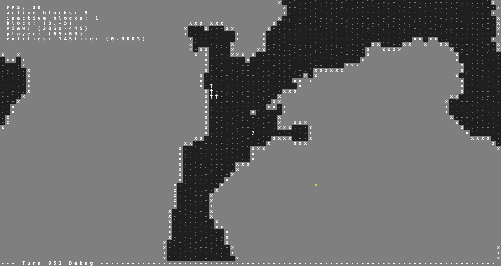
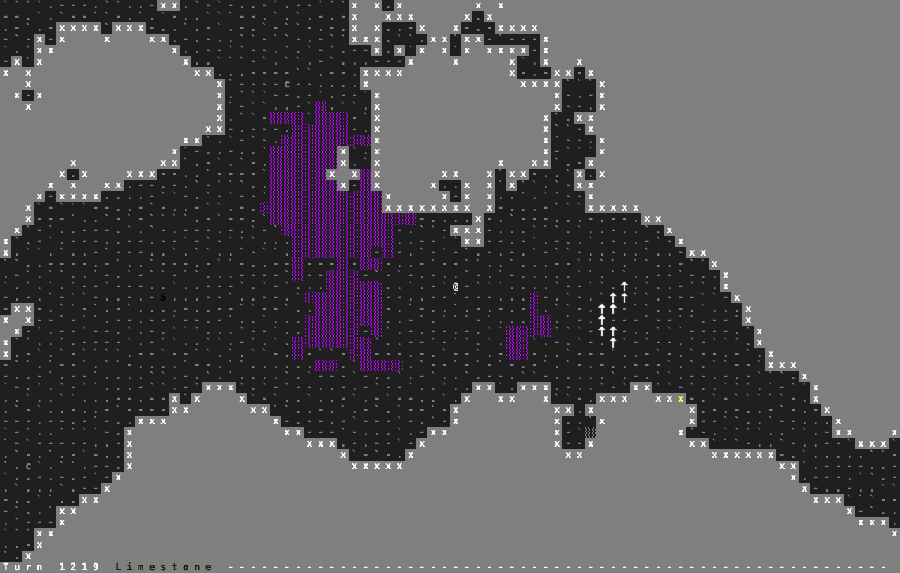
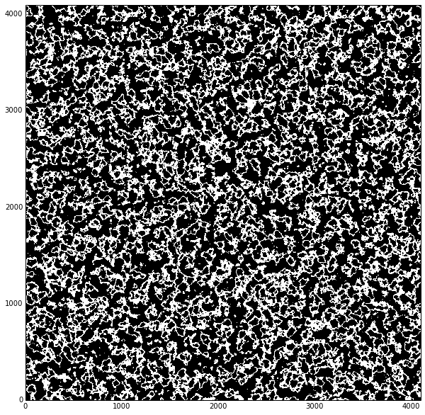

This is a Procedural Generated Rougelike I'm currently working on.

# Gameplay

#### Digging(and viewable/hidden areas)

#### Fungus Growth in Fast Mode

#### An "Overworld"

# Current Features

- seed-based terrain generation
- on the fly world generation/serialization
- basic entiity generation
    - basic stable entity ecosystem
- turn-based movement
- basic player actions(movement, wait, dig, build, kill)

 # Controls

 * To kill(for entities): `k + ↑↓←→`
 * To dig(for diggable tiles): `d + ↑↓←→`
 * To build(for generic wall tile): `b + ↑↓←→`
 * '.' to wait, 
 * shift + '.' to fast wait, ESC to exit

Inspect with mouse  
4-way movement with arrow keys  

# Download

... I have yet to do this. 
If anyone is interested feel free to bug me 
The current state of this game is very toy-like though. 

# Compilation

You need to install 

* gcc
* python 2.7
* python development headers(python-devel or python-dev)
* sdl1.2
* sdl_ttf

On ubuntu this is

    sudo apt-get install gcc python python-devel sdl1.2debian libsdl-ttf2.0-dev

Windows and linux dlls/SOs for libtcod are included

After all the dependencies are installed, run

    make build

In the root directory

This should build all the shared objects that the game depends on(draw_text, mynoise)

# To Run

from the root directory run

    ./cave-dweller.py
